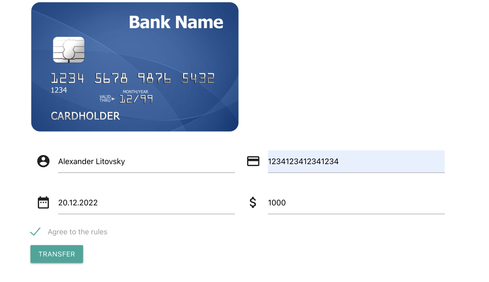

# React Shop
Test UI APP for testing https://berpress.github.io/react-shop/

Hey! This is an application for testing interfaces. Application uses Api (https://github.com/berpress/flask-restful-api).
See Swagger: https://app.swaggerhub.com/apis-docs/berpress/flask-rest-api/1.0.0 and api url https://stores-tests-api.herokuapp.com .

#### Examples of api and ui tests in different languages
| Language      | Link           | Status  |
| ------------- |:-------------:| -----:|
| Python      | https://github.com/berpress/python-api-tests ||
| JS      |  https://github.com/berpress/js-api-tests| |
| TS |not added yet, you can do this |not added|
| JAVA |not added yet, you can do this|not added|
| Postman |https://github.com/berpress/postman-api-tests|✅🇷🇺|

The app is written in JS and React.

The app simulates the operation of a good store.

### Description:
Open app https://berpress.github.io/react-shop/
If you see this message "Nothing here, see github", then click on the button to create data using api to fill the store with data

Register new user 

Sign in 

Update your balance 

Select item 

Buy your items in cat

